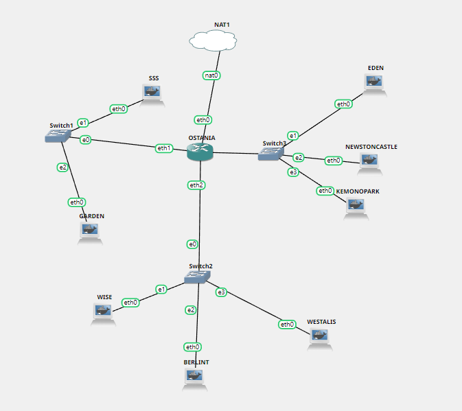
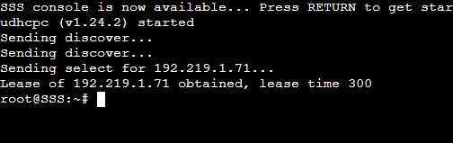
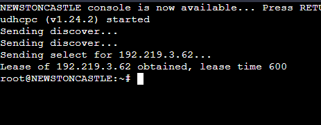
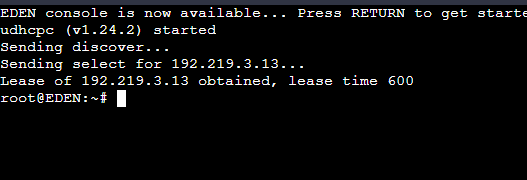
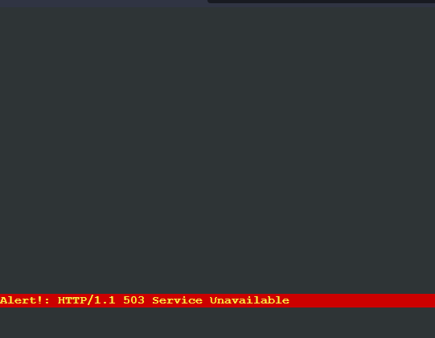
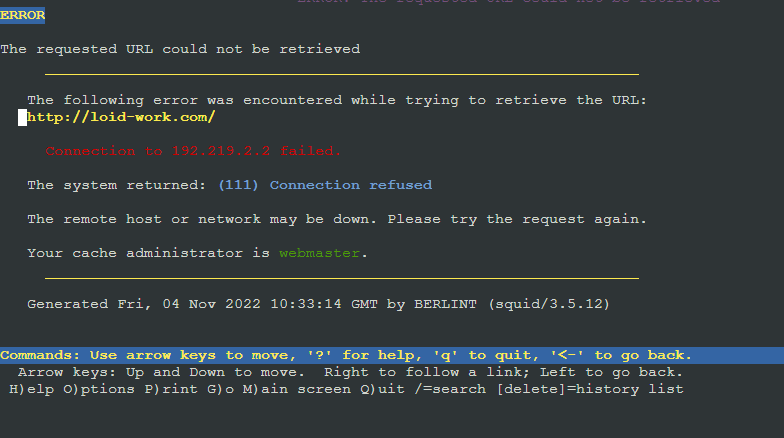
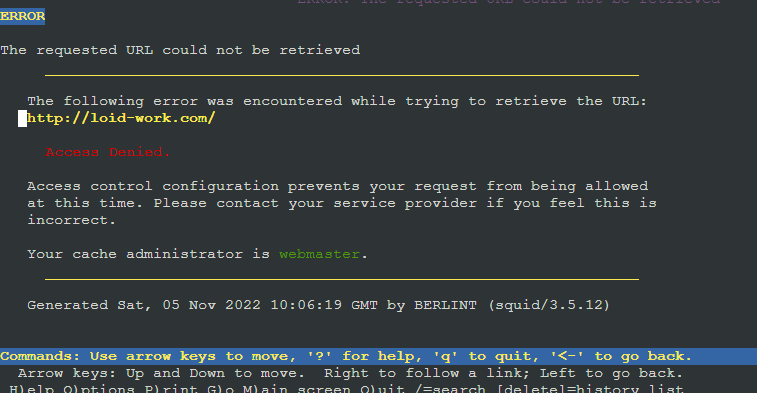
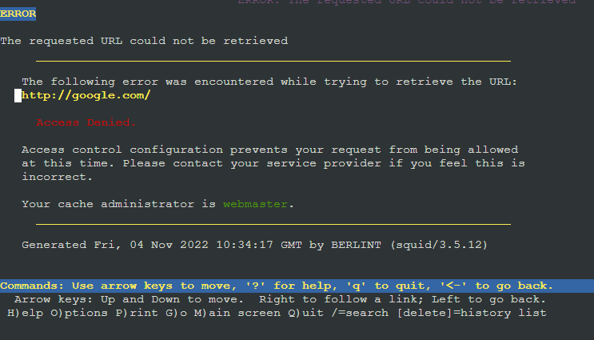

# Jarkom-Modul-3-ITB10-2022

**Jovan Surya Bako 5027201013**		

**Gde Rio Aryaputra Rahadi   5027201063**
```
                        gambar topologi
```

## :large_blue_circle: **Soal 1** :large_blue_circle: 

Loid bersama Franky berencana membuat peta tersebut dengan kriteria WISE sebagai DNS Server, Westalis sebagai DHCP Server, Berlint sebagai Proxy Server (1)

Konfigurasi router Ostania 
```
auto eth0
iface eth0 inet dhcp

auto eth1
iface eth1 inet static
	address 192.219.1.1
	netmask 255.255.255.0
```
auto eth2
iface eth2 inet static
	address 192.219.2.1
	netmask 255.255.255.0

``` 
auto eth3
iface eth3 inet static
	address 192.219.3.1
	netmask 255.255.255.0
```

Konfigurasi WISE
```
auto eth0
iface eth0 inet static
	address 192.219.2.2
	netmask 255.255.255.0
	gateway 192.219.2.1
```

Konfigurasi Berlint
```
auto eth0
iface eth0 inet static
	address 192.219.2.3
	netmask 255.255.255.0
	gateway 192.219.2.1
```

Konfigurasi Westalis
```
auto eth0
iface eth0 inet static
	address 192.219.2.4
	netmask 255.255.255.0
	gateway 192.219.2.1
```

Konfigurasi node-node lain
```
auto eth0
iface eth0 inet dhcp
```

```
iptables -t nat -A POSTROUTING -j MASQUERADE -o eth0 -s 192.219.0.0/16
```
pada router Ostania
```
echo "nameserver 192.168.122.1" > /etc/resolv.conf 
```
pada WISE, Berlint, dan Westalis

Mengupdate package list pada Ostania, WISE, Berlint, dan Westalis
```
apt-get update
```
Menginstall isc-dhcp-server pada Westalis
```
apt-get install isc-dhcp-server -y
```
Menginstall bind9 pada WISE
```
apt-get install bind9 -y
```
Menginstall squid3 pada Berlint
```   
apt-get install squid -y
```
Konfigurasi DHCP dengan membuka file /etc/default/isc-dhcp-server pada Westalis dan menambahkan eth0

## :large_blue_circle: **Soal 2** :large_blue_circle: 
dan Ostania sebagai DHCP Relay (2)

Menjalankan command pada Ostania 
```
apt-get update
apt-get install isc-dhcp-relay -y 
```
untuk menginstall isc-dhcp-relay, saat menginstall akan muncul beberapa pertanyaan, input IP Westalis (192.219.2.4) dan interfaces eth1 eth2 eth3

Kemudian restart service
```
service isc-dhcp-relay restart
```

Semua client yang ada HARUS menggunakan konfigurasi IP dari DHCP Server.
## :large_blue_circle: **Soal 3** :large_blue_circle: 
Client yang melalui Switch1 mendapatkan range IP dari [prefix IP].1.50 - [prefix IP].1.88 dan [prefix IP].1.120 - [prefix IP].1.155 (3)

Agar node-node client mendapatkan IP dari DHCP server maka pada konfigurasi dibuat seperti: 
auto eth0
iface eth0 inet dhcp
Pada Westalis edit file /etc/dhcp/dhcpd.conf menambahkan subnet .1.0 dengan konfigurasi:
```
subnet 192.219.1.0 netmask 255.255.255.0 {
        range 192.219.1.50 192.219.1.88;
        range 192.219.1.120 192.219.1.155;
        option routers 192.219.1.1;
        option broadcast-address 192.219.1.255;
        option domain-name-servers 192.219.2.2;
        default-lease-time 300;
        max-lease-time 6900;
    }
```

Lalu restart service
service isc-dhcp-server restart\
\
hasilnya pada SSS

## :large_blue_circle: **Soal 4** :large_blue_circle: 
Client yang melalui Switch3 mendapatkan range IP dari [prefix IP].3.10 - [prefix IP].3.30 dan [prefix IP].3.60 - [prefix IP].3.85 (4)

Pada Westalis edit file /etc/dhcp/dhcpd.conf menambahkan subnet .3.0 dengan konfigurasi:
```
    subnet 192.219.3.0 netmask 255.255.255.0 {
        range 192.219.3.10 192.219.3.30;
        range 192.219.3.60 192.219.3.85;
        option routers 192.219.3.1;
        option broadcast-address 192.219.3.255;
        option domain-name-servers 192.219.2.2;
        default-lease-time 600;
        max-lease-time 6900;
    }
```
Lalu restart service
service isc-dhcp-server restart 

hasil pada newtoncastle



## :large_blue_circle: **Soal 5** :large_blue_circle: 
Client mendapatkan DNS dari WISE dan client dapat terhubung dengan internet melalui DNS tersebut. (5)
Sudah dikonfigurasi di nomor 3 dan 4 pada line
option domain-name-servers 192.219.2.2;

Pada WISE set DNS forwarders dan comment dnssec-validation auto; pada file /etc/bind/named.conf.options
```
options {
        directory "/var/cache/bind";
forwarders {
  192.168.122.1;
};

// dnssec-validation auto;
```
Lalu restart service bind9 

## :large_blue_circle: **Soal 6** :large_blue_circle: 
Lama waktu DHCP server meminjamkan alamat IP kepada Client yang melalui Switch1 selama 5 menit sedangkan pada client yang melalui Switch3 selama 10 menit. Dengan waktu maksimal yang dialokasikan untuk peminjaman alamat IP selama 115 menit. (6)
Sudah dikonfigurasi di nomor 3 dan 4 pada line
```
subnet 192.219.1.0 …
default-lease-time 300;
max-lease-time 6900;
```
```
subnet 192.219.3.0 …
default-lease-time 600;
max-lease-time 6900;
```
## :large_blue_circle: **Soal 7** :large_blue_circle: 
Loid dan Franky berencana menjadikan Eden sebagai server untuk pertukaran informasi dengan alamat IP yang tetap dengan IP [prefix IP].3.13 (7)
Mencari hwaddress_Eden dengan mengeksekusi command ip a di Eden, kemudian mengcopy address pada section link/ether di bagian eth0, yakni 7a:ed:ff:1c:84:b0, terlebih dahulu dimasukkan ke konfigurasi Eden agar tidak berubah saat restart
```
auto eth0
iface eth0 inet dhcp
hwaddress ether 7a:ed:ff:1c:84:b0
```
 
 kemudian dimasukkan pada konfigurasi isc-dhcp-server di Westalis. Dengan command line 
```
host Eden {
        hardware ethernet 7a:ed:ff:1c:84:b0;
        fixed-address 192.219.3.13;
    }
```
setelah itu restart isc-dhcp-server dan juga node Eden

hasil yang didapatkan
    


## :large_blue_circle: **Soal 8-11(1-4)** :large_blue_circle: 
Client hanya dapat mengakses internet diluar (selain) hari & jam kerja (senin-jumat 08.00 - 17.00) dan hari libur (dapat mengakses 24 jam penuh)
```
mv /etc/squid/squid.conf /etc/squid/squid.conf.bak
```
awalya kita backup terlebih dahulu squid.conf.

lalu kita buat file acl.conf, acl-bandwidth.conf, restrict-sites.acl pada folder squid

acl.conf: digunakan untuk menyimpan list apa saja yang akan di deny dan di allow
berikut adalah isinya
```
acl AVAILABLE_WORKING time MTWHF 08:00-17:00
acl HARI_LIBUR time SA 00:00-23:59
acl JAM_KOSONG time MTWHF 17:01-23:59
acl JAM_KOSONG time MTWHF 00:00-07:59
```
pada list tersebut berisikan kalau hari senin sampai jumat jam 08:00-17:00 adalah jam kerja, hari sabtu dan minggu adalah hari libur, dan pada jam 17:01-07:59 adalah jam kosong

selanjutnya pada restrict-sites.acl
berisikan list web apa saja yang tidak bisa diakses
```
loid-work.com
franky-work.com
```
kedua web tersebut hanya bisa diakses hanya pada jam kerja saja

untuk acl-bandwidth.conf berisikan pembatasan bandwidth untuk client

```
delay_pools 1
delay_class 1 1
delay_access 1 allow all
delay_parameters 1 4000/64000
```


setelah itu pada file squid.conf tersebut kita tambahkan kode berikut
```
include /etc/squid/acl.conf
include /etc/squid/acl-bandwidth.conf
acl dom_ain dstdomain "/etc/squid/restrict-sites.acl"
http_port 8080
visible_hostname BERLINT

http_access allow dom_ain AVAILABLE_WORKING
http_access deny dom_ain HARI_LIBUR
http_access deny HARI_LIBUR
http_access deny dom_ain JAM_KOSONG
http_access deny all
dns_nameservers 192.219.2.2
```
http_access allow dom_ain AVAILABLE_WORKING: untuk memperbolehkan domain loid-work.com dan franky-work.com 


http_access deny dom_ain HARI_LIBUR :agar domain loid-work.com dan franky-work.com tidak bisa diakses di hari libur 


http_access deny dom_ain JAM_KOSONG : tidak bisa mengakses  domain loid-work.com dan franky-work.com pada jam kosong

http_access deny all: untuk memblock web yang menggunakan http
dns_nameservers 192.219.2.2 : memasukan dns server agar bisa masuk ke domain loid-work.com dan franky-work.com 

## :large_blue_circle: **Soal 9(2)** :large_blue_circle: 

  
jika loid-work.com dan franky-work.com dibuka pada hari kerja maka akan muncul seperti itu  
(kami belum menginstall web server maka akan muncul seperti itu)
  
lalu untuk gambar seperti di atas jika loid-work dan franky-work.com dibuka pada jam luar kerja dan hari libur


## :large_blue_circle: **Soal 10(3)** :large_blue_circle: 
  
untuk gambar diatas jika mengakses http diluar ataupun didalam jam kerja


